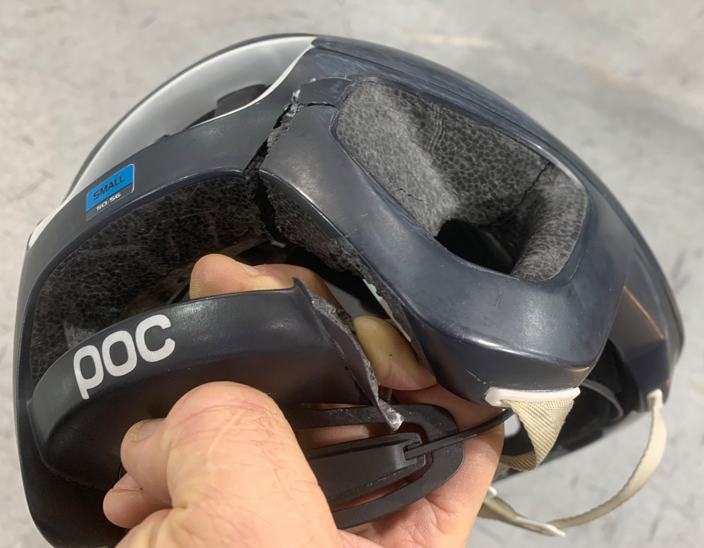

{class="center"}

BANG! Hisss…! A Puncture! But who? Where? I’m riding in a peloton of 24 tightly packed riders in the middle of the steep banking on the Pan-Am Games Velodrome in Milton Ontario. It’s impossible to stay up on the banking after a puncture. Everyone knows someone is going down, and is going to take other riders with them. I’m a loser of this lottery. The rider with the puncture slides down in front of me and I flip over their bike at 34KPH, as four of us go down.

We untangle ourselves. No damage done I think … I get back on my bike to ride off the adrenaline and avoid stiffening up. **WITHOUT CHECKING MYSELF OR MY EQUIPMENT!** As I calm down I realize I need to carefully assess my bike and myself… I get off the track and check. Me, well I have a contusion the size of a tennis ball on my shin, must be from hitting a bike, but not really a medical issue. And my bike is OK.

{class="right"}
BUT MY HELMET IS DESTROYED! I didn’t even realize I’d hit my head! Obviously I hit it hard, and the helmet did its job. Now I had to assume head trauma could be a possibility. I removed myself from the training, borrowed another helmet, fitted it to me, made sure I was always where someone could monitor me, and I rode slowly on my own, off the track.
    

## A Checklist for After a Rider Crashes

The adrenaline will be pumping… an injured rider will not necessarily feel pain, and often will say “I’m OK” and want to get back on their bike. NO! Take it slow and do a thorough check:

1. Check the rider carefully for possible injury. Have them move all their limbs, stretch, bend. Move their head around. Check for any discomfort, disorientation or dizziness.
2. Did the rider hit their head? Did anyone see if the rider hit their head?
3. Check the helmet very carefully for any dent or crack, no matter how small.
4. Check the bike very carefully for any damage.
5. If there is **any** indication the rider hit their head, you **must** assume that a concussion or other head trauma is a possibility:
    * If at all possible, the rider is “done for the day”.  Stop riding, pick them up in a car. Have someone stay with the rider at all times.
    * But in the middle of nowhere, that may not be possible… If the rider is not showing any symptoms, OK, ride slowly and carefully to where they can be picked up. Keep space around the injured rider, and watch them carefully, never leave them alone.
6. You should not ride with a damaged helmet! Another good reason to “be done for the day” if you hit your head in a crash.

## Treat Your Helmet With the Respect It Deserves

* Helmets are “single use”… once they have done their job protecting your head in a crash, they are no longer effective and **must** be replaced. (even if you don’t see any visible damage)
* Check you helmet regularly for any cracks or dents… replace your helmet if you see any damage
* Bicycle helmets **must** be replaced even 5 years. If you ride a lot, every 3 years is best.
* Be sure your helmet fits properly. Follow the 2V1 rule:
  * 2 fingers spacing between your eyebrows and the edge of the helmet
  * side straps form a V between the front and back of your ears, and join just below the ear.
  * No more than 1 finger of  space under the chin strap.
* This video does a terrific job of explaining everything [CAN-BIKE Helmet Check](https://www.facebook.com/watch/?v=311361923454988&extid=YotjpOHcgsAsoU6I)

For reference, you can also download the [Ontario Cycling Association Concussion Policy](https://eventsquare-ccn-prod.s3.amazonaws.com/uploads/files/Concussion_Policy_-_UPDATED_JUNE_27-201906271436.pdf).
